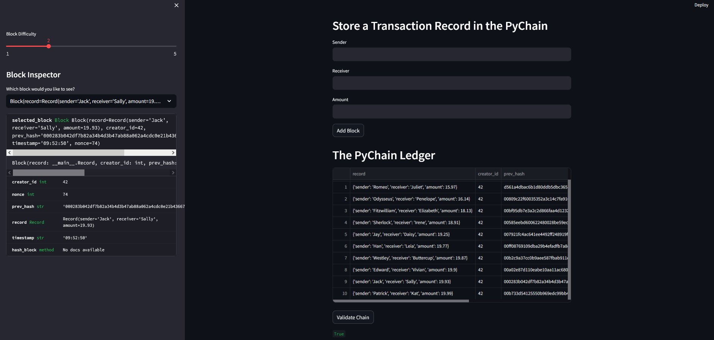

# Fintech Bootcamp - Blockchain Challenge

## Summary

This repository contains the files for the module 18 homework assignment: blockchain challenge.

## File description

### Primary Code

All of the primary code can be found in the Python file titled "pychain.py", which is located in this folder.

### Images

All of the images illustrating the performance of the web application can be found in the Images folder:

- streamlit_blockchain.png

## Streamlit Application

The following image of the Streamlit application shows the blockchain containing 10 non-genesis blocks with various transaction amounts.  It also shows that each transaction has a unique hash value and that the whole chain is valid.

